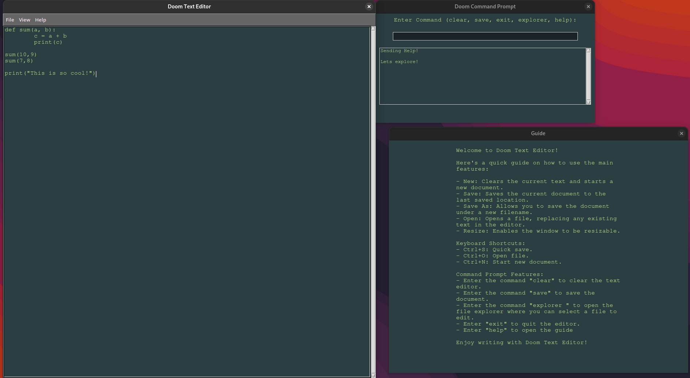
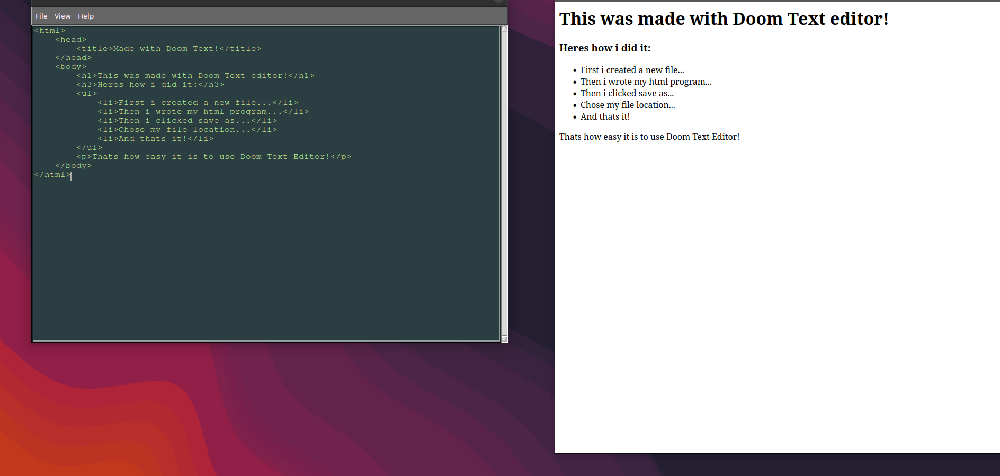
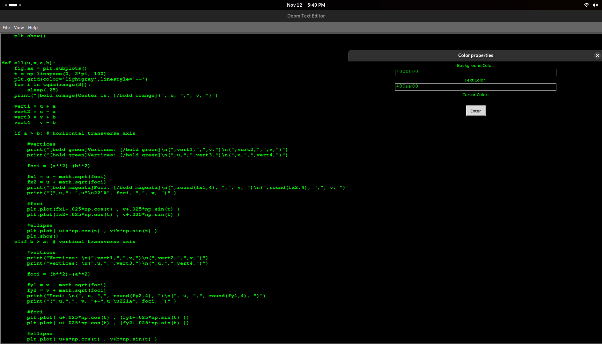

# Doom Text Editor

Doom Text Editor is an advanced text editor with a dark, "Doom-inspired" aesthetic and enhanced functionalities, including a command console for quick command execution.



## Features
- **Advanced Text Editing**: Supports saving, opening, and editing files.
- **Command Console**: Execute commands directly within the editor, like saving, opening files, and clearing text.
- **Stylized User Interface**: Customizable dark theme with additional menus and command shortcuts.

## Installation and Setup

### Requirements
- Python 3.x
- tkinter
- pyinstaller(optional)

To start the application:

python main.py

Building as an Executable

Follow the steps below to convert the Doom Text Editor into an executable on Linux, Windows, and macOS.
Linux (e.g., Arch Linux)


```
pyinstaller --onefile --windowed main.py
```
This will generate a standalone executable in the dist folder.


    Create a .desktop file in ~/.local/share/applications/.

```
[nano/vim/nvim/etc...] ~/path/to/project/folder/[chosen_nameof_desktop_file].desktop
```


    Add the following content to the file:
```
    [Desktop Entry]
    Name=Doom Text Editor
    Comment=Advanced Text Editor with Doom Vibes
    Exec=/home/username/path/to/DoomTextEditor
    Icon=/home/username/path/to/icon.png
    Terminal=false
    Type=Application
    Categories=Utility;TextEditor;
```
Replace /home/username/path/to/DoomTextEditor with the actual path to your executable, and update the Icon path as needed.

Update the Application Database: Run the following command to register the desktop entry:
```
    update-desktop-database ~/.local/share/applications/
```
    You should now be able to find Doom Text Editor in your applications menu.

Windows

    Generate the Executable: Use PyInstaller to create an .exe:
```
    pyinstaller --onefile --windowed main.py
```

    This will place an executable in the dist folder.

    Create a Shortcut:
        Right-click the DoomTextEditor.exe file and select Create shortcut.
        Move the shortcut to your Start menu or desktop.

    Add an Icon (Optional):
        Right-click the shortcut and select Properties.
        Under the Shortcut tab, click Change Icon and select your custom icon file.

    Launch Doom Text Editor:
        Now, you can launch Doom Text Editor directly from the shortcut on your desktop or Start menu.

macOS

    Generate the Executable:
        Run PyInstaller to create a macOS app bundle:

```
        pyinstaller --onefile --windowed main.py
```

    Add Application Metadata:
        In the dist folder, rename the output to DoomTextEditor.app.
        Place the app in your /Applications directory for easy access.

    Add Icon (Optional):
        Use macOS tools like Icon Composer or Image2Icon to convert an image to .icns format.
        Add the .icns file to your app’s Resources directory, then update the .plist to reflect the icon change.

Guide for Using Doom Text Editor

The Doom Text Editor includes helpful features, such as a guide and built-in commands.

    Guide: Access the guide from the "Help" menu to see all shortcuts and features.
    Command Console: Press "Show Command Prompt" in the View menu to open the console, where you can execute commands:
        clear - Clears the editor.
        save - Saves the current document.
        explorer - Openes file explorer
        exit - Closes the text editor.





Enjoy using Doom Text Editor!
